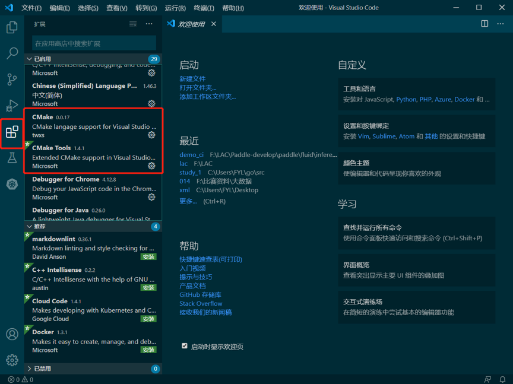
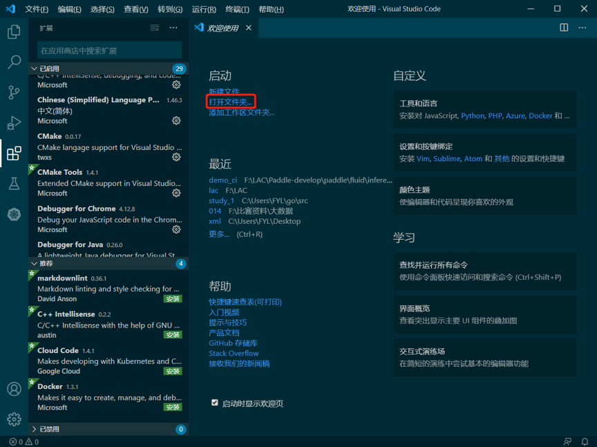
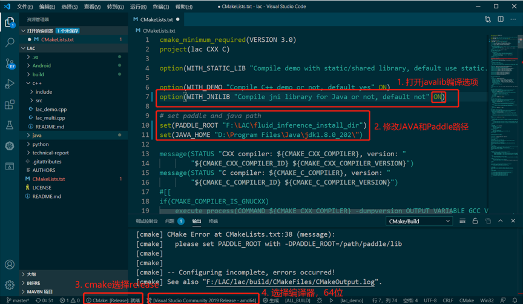
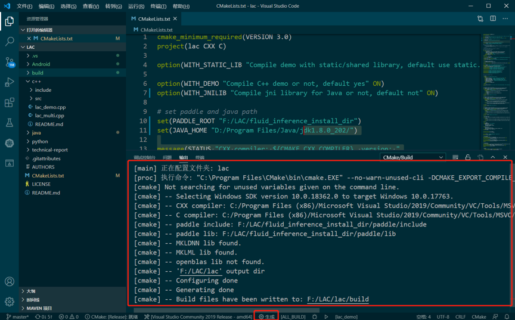
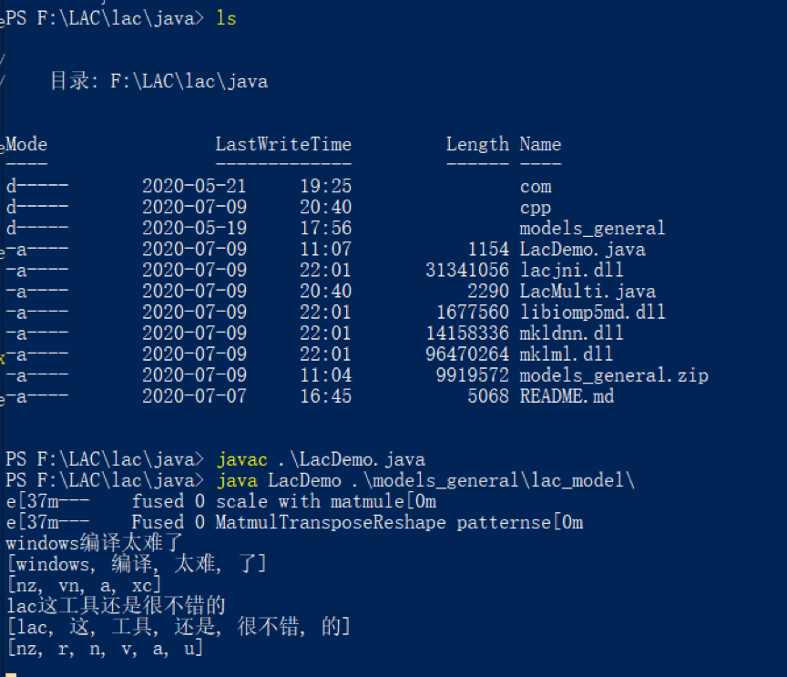

## 在Windows系统编译LAC

本文档详细介绍如何在Windows上使用Visual Studio和Visual Studio Code 完成LAC的C++ demo 及 Java链接库编译的过程。

### 1. 环境准备

##### 1. 安装 Visual Studio和Visual Studio Code 

- 官网下载地址：[https://visualstudio.microsoft.com/zh-hans/](https://visualstudio.microsoft.com/zh-hans/)
-  Visual Studio安装可参考：[VS安装文档](https://docs.microsoft.com/zh-cn/visualstudio/install/install-visual-studio?view=vs-2019)，工作负载中勾选`C++桌面开发`的选项

##### 2. 下载Paddle相关的依赖库

- 可于[Paddle官网](https://www.paddlepaddle.org.cn)下载已经编译好的[Windows预测库](https://www.paddlepaddle.org.cn/documentation/docs/zh/advanced_guide/inference_deployment/inference/windows_cpp_inference.html)（`fluid_inference.tgz`），选择`cpu_avx_mkl`或`cpu_avx_openblas`版本进行下载并解压

### 2. 编译运行

编译过程使用`Visual Studio Code`进行，该工具能够帮助我们完成cmake编译等过程，并且在众多系统中表现出较好的兼容性，该流程同样适用于Mac和Linux系统。

##### 1. 在VS Code中安装Cmake相关插件



##### 2. 打开GitHub中clone下来的文件夹



##### 3. 设置编译选项

- 设置`PADDLE_ROOT`为[Windows预测库](https://www.paddlepaddle.org.cn/documentation/docs/zh/advanced_guide/inference_deployment/inference/windows_cpp_inference.html)下载解压后的文件夹路径
- 若需编译**JAVA的链接库**，需将`WITH_JNILIB`选项设为`ON`，同时设置`JAVA_HOME`路径，如下图所示
- CMake选择Release模式
- 编译器选项选择Visual Studio amd64【若无该选项则选择`扫描工具包`或检查`Visual Studio`安装情况】



##### 4. 执行编译

- 完成上述步骤后，如果lac目录下已生产build目录，先删除该build目录，否则option中的选项不会更新

- 打开CMakeLists.txt，执行保存，会触发CMake构建命令，生产build目录。

- CMake构建完成后运行`生成`，既可触发编译

  

#####5. 运行示例

- 编译完成后，会在build/Release 生成相应的文件产出：

  - `lac_demo.exe`和`lac_multi.exe`：lac的单线程和多线程执行程序，从命令行中读取**UTF8**编码的输入，执行预测
  - `lacjni.dll`：JAVA调用lac使用的动态库
  - `*.dll`：运行lac所依赖的算法库，MKLNN库(mklnn.dll、mklml.dll、libiomp5md.dll)或OPENBLAS库（openblas.dll）

- 下载模型文件：

  在[release界面](https://github.com/baidu/lac/releases/)下载模型文件`models_general.zip`，解压文件夹中包含两个模型

  - `seg_model`：仅实现分词的模型
  - `lac_model`：实现分词、词性标注、实体识别于一体的词法分析模型

-  `lac_demo.exe`和`lac_multi.exe`运行测试

  - 修改CMD编码为**utf8**
  - 在命令行中运行以下指令

  ```sh
  # 运行测试
  ./lac_demo.exe <model_dir> 
  ./lac_multi.exe <model_dir> <thread_num>
  # model_dir: 模型文件路径，即上述下载解压后的路径，如 "./models_general/lac_model"
  # thread_num: 线程数
  ```

- JAVA调用运行测试

  - 将`lacjni.dll`和依赖的算法库拷贝到`lac/java`目录下

  - 在命令行工具中运行测试如下所示

    

